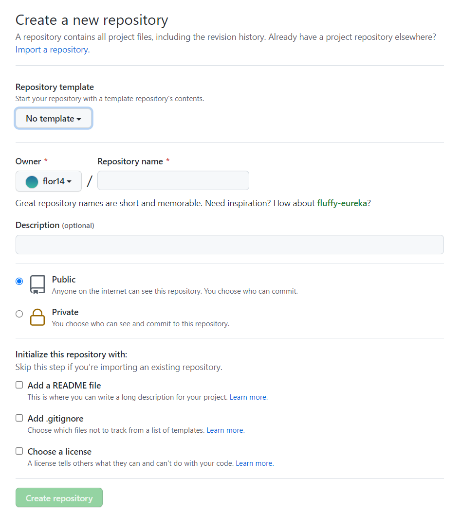

```{r setup, include=FALSE}
options(htmltools.dir.version = FALSE)
```

```{r xaringan-themer, include=FALSE, warning=FALSE}
library(xaringanthemer)
library(xaringanExtra)
library(tidyverse)
library(knitr)
library(nomnoml)
library(countdown)
xaringanExtra::use_logo(
  image_url = "https://raw.githubusercontent.com/rstudio/hex-stickers/master/PNG/xaringan.png"
)
xaringanExtra::use_panelset()
xaringanExtra::use_broadcast()
xaringanExtra::use_share_again()
xaringanExtra::style_share_again(share_buttons = c("twitter", "linkedin"))
xaringanExtra::use_tachyons()
xaringanExtra::use_fit_screen()
xaringanExtra::use_tile_view() # O
style_mono_accent(
  base_color = "#0dc96f",
  background_color = "#ffffff",
  inverse_background_color = "#3298cb",
  header_color = "#022044",
  inverse_header_color = "#ffffff", 
  inverse_text_color = "#ffffff",
  code_inline_color = "#179c55",
  link_color= "#0000FF",
  text_font_size = "25px",
  header_font_google = google_font("Poppins", "Regular", "400"),
  text_font_google   = google_font("Darker Grotesque", "500"),
  code_font_google   = google_font("Fira Mono"),
  )

```

```{r metathis, warning=FALSE, echo=FALSE}
# library(metathis)
# meta() %>%
#   meta_name("github-repo" = "flor14/rladies-jujuy") %>% 
#   meta_social(
#     title = "Meetup R-Ladies Jujuy",
#     description = paste(
#       "Mi próximo artículo científico con R:", 
#       "Compendios de Investigación, Reproducibilidad e",
#       "Interactividad en las publicaciones académicas"
#     ),
#     url = "https://flor14.github.io/rladies-jujuy/presentacion.html?panelset=licencia#1",
#     image = "https://res.cloudinary.com/flor/image/upload/v1608248822/jujuy-colores_frmvax.jpg",
#     image_alt = paste(
#       "Charla para el capítulo de R-Ladies de Jujuy, Argentina.",
#       "Diciembre de 2020"
#       ),
#     og_type = "website",
#     og_author = "Florencia D'Andrea",
#     twitter_card_type = "summary_large_image",
#     twitter_creator = "@cantoflor_87",
#     twitter_site = "@cantoflor_87"
#   )
```


class: middle, center

```{r hex, fig.align='center', echo = FALSE, out.width=150} 
    knitr::include_graphics("img/hex.png")
```


---


class: bottom

.bg-washed-blue.b--dark-blue.ba.bw2.br3.shadow-5.ph4.mt5[
### DSCI 521 - Lecture 2
### **Getting groovy with Git and GitHub**

 .large[#### Computing Platforms for Data Science - UBC MDS 2021/22
]]

---

## Lecture 2

1. Create a **new repository** on GitHub via the web interface

--


2. `git log` and `git restore`

--

3. Deal with **merge conflicts** at the command line and in VS Code

--

4. Stash your changes with `git stash` before pulling from GitHub

---

## using git

```{r git, fig.align='center', echo = FALSE,out.width=250} 

```


---
class: middle, center, inverse


# CREATING A REPOSITORY

---


.pull-left[


```{r git2, fig.align='center', echo = FALSE, out.width=200} 
knitr::include_graphics("img/github_online.png")
```

#### Method 1
1. **Create it on GitHub** 
2. Clone it to your local computer

]

--

.pull-right[


```{r git3, fig.align='center', echo = FALSE,out.width=185} 
knitr::include_graphics("img/git_local.png")
```


#### Method 2 
1. **Start in your local computer**
2. Create a new repository on GitHub 
3. Use Git to tell your local repository where the remote is
]


--


.bg-washed-blue.b--dark-blue.ba.bw2.br3.shadow-5.ph4.mt5[

**Method 1** is usually the most convenient 

]


---

class: middle, center, inverse


# CREATING A REPOSITORY
### from GitHub


---

### www.github.com 
```{r repo, fig.align='center', echo = FALSE,out.width=500} 

```

---

## Cloning repositories from GitHub

* You can use GitHub to edit if you have minor changes. 

* To be able to modify the code on your machine, we need to clone the repository


```{r repo2, fig.align='center', echo = FALSE,out.width=700} 
knitr::include_graphics("img/edit_repo.png")
```


---


class: middle, center

### Download or clone a repo?


---

```{r clone, fig.align='center', echo = FALSE,out.width=300} 

```

---

### Make changes to your files in the remote repo on GitHub


.pull-left[


```{r git22, fig.align='center', echo = FALSE, out.width=200} 
knitr::include_graphics("img/github_online.png")
```

#### Edit files directly on Github via the web interface
1. Click on the pen tool 
2. Edit the file
3. Provide a commit message 
4. Click on the button "Commit changes" 
5. Clone this repo to your local computer
]

--

.pull-right[


```{r git32, fig.align='center', echo = FALSE,out.width=185} 
knitr::include_graphics("img/git_local.png")
```


#### Working locally
1. Make changes on files you cloned
2. `git add` add them to the staging area
3. `git commit` provide a commit message
4. `git push` the changes to GitHub

]

.bg-washed-blue.b--dark-blue.ba.bw2.br3.shadow-5.ph4.mt5[

Note that there is no step for adding to the staging area on GitHub.
The button "Commit changes" to save your work is essentially `git add` + `git commit` in one click.

]


---

class: middle, center, inverse

#  VIEWING YOUR GIT HISTORY 

---

## `git log`
#### Viewing the history of a project

```{r gitlog, fig.align='center', echo = FALSE,out.width=700} 
knitr::include_graphics("img/gitlog.png")
```
> You can use `git log --oneline` for more succinct output 

---

class: middle, center, inverse

#  RESTORING AN OLDER VERSION
---

## Refer to a commit 

* Each commits has a full 40-character SHA-1 hash

```bash
commit b22d6421363c7b82e2b88b0b5f1f25edca703303
```
* You can use a short SHA-1 (at least four characters long and unambiguous)

```bash
commit b22d
```

> You can use the command `git show <SHA>` 

.footnote[[Git Tools](https://git-scm.com/book/en/v2/Git-Tools-Revision-Selection)]


---

## `git restore`
#### Restoring an older version of a file


```bash
 git restore -s SHORT_SHA-1 FILENAME
```

> Do not forget to add and commit the changes!

---


class: middle, center

### Live demo

---

```{r pushpull, fig.align='center', echo = FALSE,out.width=700} 

```


---

class: middle, center, inverse

# MERGE CONFLICTS

---

## `git pull`

1. **fetch** the content of the remote
2. **merge** it into your repository

---


<<<<<<< HEAD precedes the change you made (that you couldn't push)
======= is a separator between the conflicting changes
>>>>>>> dabb4c8c450e8475aee9b14b4383acc99f42af1d flags the end of the conflicting change you pulled from GitHub


---

## How do you know you have a merge conflict?


> Can you have a merge conflict working alone?

---

## What do you do to fix a merge conflict?

---

class: middle, center, inverse

# Stashing 
#### local non-committed changes before pulling


---

```bash
error: Your local changes to the following files would be overwritten by merge:
        README.md
Please commit your changes or stash them before you merge.
Aborting
```

---

.bg-washed-green.b--dark-green.ba.bw2.br3.shadow-5.ph4.mt5[ 

## Attribution

* [Happy Git and GitHub for the useR](https://happygitwithr.com/) by Jenny Bryan and the STAT 545 TAs
* [Software Carpentry](https://software-carpentry.org/lessons/), specifically the Unix Shell and Git lessons

                                                                                                                                      
]


---

class: inverse, middle, center

# Thank you!
