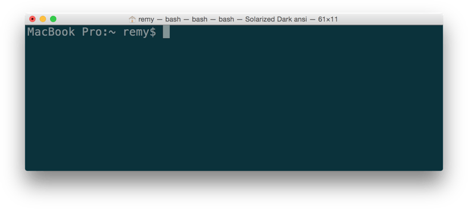

```{r setup, include=FALSE}
options(htmltools.dir.version = FALSE)
```

```{r xaringan-themer, include=FALSE, warning=FALSE}
library(xaringanthemer)
library(xaringanExtra)
library(tidyverse)
library(knitr)
library(nomnoml)
library(countdown)
xaringanExtra::use_logo(
  image_url = "https://raw.githubusercontent.com/rstudio/hex-stickers/master/PNG/xaringan.png"
)
xaringanExtra::use_panelset()
xaringanExtra::use_broadcast()
xaringanExtra::use_share_again()
xaringanExtra::style_share_again(share_buttons = c("twitter", "linkedin"))
xaringanExtra::use_tachyons()
xaringanExtra::use_fit_screen()
xaringanExtra::use_tile_view() # O
style_mono_accent(
  base_color = "#0dc96f",
  background_color = "#ffffff",
  inverse_background_color = "#3298cb",
  header_color = "#022044",
  inverse_header_color = "#ffffff", 
  inverse_text_color = "#ffffff",
  code_inline_color = "#179c55",
  link_color= "#0000FF",
  text_font_size = "25px",
  header_font_google = google_font("Poppins", "Regular", "400"),
  text_font_google   = google_font("Darker Grotesque", "500"),
  code_font_google   = google_font("Fira Mono"),
  )

```

```{r metathis, warning=FALSE, echo=FALSE}
# library(metathis)
# meta() %>%
#   meta_name("github-repo" = "flor14/rladies-jujuy") %>% 
#   meta_social(
#     title = "Meetup R-Ladies Jujuy",
#     description = paste(
#       "Mi próximo artículo científico con R:", 
#       "Compendios de Investigación, Reproducibilidad e",
#       "Interactividad en las publicaciones académicas"
#     ),
#     url = "https://flor14.github.io/rladies-jujuy/presentacion.html?panelset=licencia#1",
#     image = "https://res.cloudinary.com/flor/image/upload/v1608248822/jujuy-colores_frmvax.jpg",
#     image_alt = paste(
#       "Charla para el capítulo de R-Ladies de Jujuy, Argentina.",
#       "Diciembre de 2020"
#       ),
#     og_type = "website",
#     og_author = "Florencia D'Andrea",
#     twitter_card_type = "summary_large_image",
#     twitter_creator = "@cantoflor_87",
#     twitter_site = "@cantoflor_87"
#   )
```


class: middle, center

```{r hex, fig.align='center', echo = FALSE, out.width=150} 
    knitr::include_graphics("img/hex.png")
```


---
class: inverse, middle, center


 ☕ ?

### Starting in ...
`r countdown(minutes = 3)`


---


class: bottom

.bg-washed-blue.b--dark-blue.ba.bw2.br3.shadow-5.ph4.mt5[
### DSCI 521 - Lecture 1
### **Shell, Git, GitHub**

 .large[#### Computing Platforms for Data Science - UBC MDS 2021/22
]]

---

## Lecture 1

#### * Software used in MDS


--

#### * Use Bash to navigate the computer's file system
    - Absolute and relative file paths
    
--

#### * Git for version control
    - Including clone, add, commit, pull, and push
    - Access, edit and submit assignments via GitHub.

---

class: middle

## The MDS software stack

#### * Bash
#### * Git
#### * Python and R
#### * VS code, JupyterLab, and RStudio

---

class: middle, center, inverse

## Open Source programs

Anyone can read the source code and contribute to these projects


---


## Open Source programs

* Use the software without paying exorbitant amounts of money

--
* Having access to the source code 

--
* Open Source software is customizable and flexible

--
* It's becoming the standard in many tech companies

--
* You are part of an awesome and active community!


---

class: middle, center, inverse

# Introduction to Computing

---

```{r women, fig.align='center', echo = FALSE, out.width=600} 
    knitr::include_graphics("img/computing.png")
```
.footnote[Ester Gerston and Gloria Gordon (1946) U.S. Army/ARL Technical Library Archives] 
    
---


```{r 22, fig.align='center', echo = FALSE, out.width=600} 
    
```

.footnote[[Photo by Pixabay from Pexels](https://www.pexels.com/photo/silver-imac-apple-magic-keyboard-and-magic-mouse-on-wooden-table-38568/)]


---

## Computer comunication

```{r cym22, fig.align='center', echo = FALSE, out.width=700} 
    knitr::include_graphics("img/computer-1.png")
```

---


## Computer comunication

```{r cym2, fig.align='center', echo = FALSE, out.width=700} 
    knitr::include_graphics("img/computer_and_machine.png")
```

---

class: middle, center, inverse

# Advantages of text-based shells

* Facilitate human interaction with the computer


---

```{r t1, fig.align='center', echo = FALSE, out.width=600} 
    knitr::include_graphics("img/win-terminals.png")
```

```{r t2, fig.align='center', echo = FALSE, out.width=600} 
    
```

.footnote[[Command line crash course - Mozilla](https://developer.mozilla.org/en-US/docs/Learn/Tools_and_testing/Understanding_client-side_tools/Command_line)
] 
   


---

class: middle, center

#### GUI are nice when you are new to something,

--

#### but text-based interfaces are actually faster and easier 

---

class: middle, center

# B·A·S·H
### the most commonly used text shell

---

class: middle, center

```{r bs1, fig.align='center', echo = FALSE, out.width=600} 
    knitr::include_graphics("img/bash.png")
```


.footnote[[Official Bash logo](https://github.com/odb/official-bash-logo)]


---


### Navigation and manipulation the filesystem usign Bash


Navigating the filesystem can be done:

--

* via your visual operating system's user interface
(e.g., Finder, Explorer, Nautilus, etc)

--

* Using a text-based shell such as Bash...

---

class: middle, center, inverse

## Live demo


---

## Commands


```{r cc, fig.align='center', echo = FALSE, out.width=500} 
    
```


---

## Commands

```{r ccc, fig.align='center', echo = FALSE, out.width=300} 
    
```

---


## Some tips

* Press `TAB` to automatically complete commands and file names as you are typing.

* Help: `man <your_command>` or `<your_command> --help`

* Up arrow to search for old commands

---

## Relative and absolute path

```bash
$pwd
/c/Users/Florencia/
```
```bash
$ cd folder1 
```
This command tries to find `folder1` inside `Florencia` folder

**RELATIVE PATH**

--
```bash
cd /c/Users/Florencia/folder1 
```
This command will find `folder1` no matter where you are

**ABSOLUTE PATH**


---

class: middle, center, inverse

# Introduction to local and remote version control software


---

## Why version control?


```{r bs, fig.align='center', echo = FALSE, out.width=300} 
    knitr::include_graphics("img/phd.png")
```

.footnote[[“Piled Higher and Deeper” by Jorge Cham](http://www.phdcomics.com)]

---

## Automatic version control (example)


.footnote[[Version control to Major Tom—keeping track of work in G Suite](https://storage.googleapis.com/gweb-uniblog-publish-prod/original_images/make_copies.gif)]


---

class: middle, center

```{r bsgit, fig.align='center', echo = FALSE, out.width=300} 
    knitr::include_graphics("img/gitlogo.png")
```

```{r bsgit2, fig.align='center', echo = FALSE, out.width=300} 
    knitr::include_graphics("img/github2.png")
```

.footnote[[Git logo](https://git-scm.com/downloads/logos)]

---

## GitHub for MDS assignments

There are 2 ways to start working with a Git repository 

1. create a new one
 
2. download an existing one

---


## GitHub for MDS assignments

There are 2 ways to start working with a Git repository 

1. create a new one
 
**2. download an existing one**
 

**CLONING**

---


## Cloning repositories from GitHub

* You can use GitHub to edit if you have minor changes

* To be able to modify the code on your machine, we need to clone the repository

---

class: middle, center

### Live demo

How to clone a repository from GitHub  

`git clone`  

---

## Changing and saving version controlled files

```{r stage, fig.align='center', echo = FALSE, out.width=700} 
knitr::include_graphics("img/staging_area.png")
```

The staging area allows more control over what you are about to commit
---

class: middle, center, inverse

## you first add the changes to the staging area and then commit them 


---

class: middle, center

### Live demo
##### Changing and saving version controlled files

`git add`

`git commit`


.footnote[[Software Carpentry](http://swcarpentry.github.io/git-novice/04-changes/)]

---

## Some `git add` commands

Adds the changes to the staging area

`git add .` - Add all updated and new files  

`git add file.txt` - Add a particular file  

--

`git add --all` - Add all updated, new, and deleted files  

`git add -u` - Add all updated and deleted files  


---

## `git commit`

saves the differences between the current and previous version 
of the file together with your message describing what you did.

`-m` for short messages from the terminal


---


## Push local changes to Github 


To upload the changes to GitHub, you need to "push" them 

`git push`


---

## Lab assignments (except lab0)

```{r stage2, fig.align='center', echo = FALSE, out.width=700} 
knitr::include_graphics("img/homework.png")
```
.footnote[[General Lab Instructions](https://ubc-mds.github.io/resources_pages/general_lab_instructions/)]


---

.bg-washed-green.b--dark-green.ba.bw2.br3.shadow-5.ph4.mt5[ 

## Attribution

* [Happy Git and GitHub for the useR](https://happygitwithr.com/) by Jenny Bryan and the STAT 545 TAs
* [Software Carpentry](https://software-carpentry.org/lessons/), specifically the Unix Shell and Git lessons

                                                                                                                                      
]


---

class: inverse, middle, center

# Thank you!
